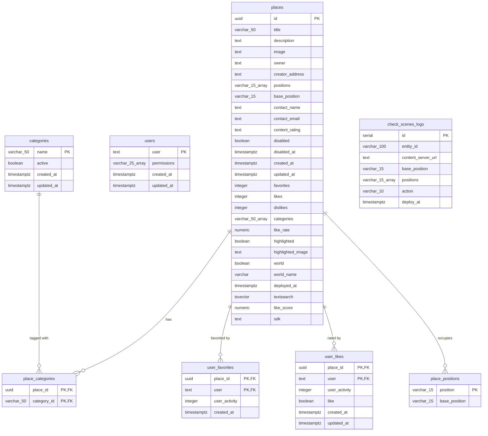

# Database Schemas - Decentraland Places Service

This document describes the PostgreSQL database schema for the Decentraland Places service. The schema is managed through migrations located in `src/migrations/` using `node-pg-migrate`.

## Database Schema Diagram



## Tables Overview

1. **places** - Main table storing scene and world information with metadata, ratings, and activity metrics
2. **users** - Registered users with Ethereum addresses and permissions
3. **categories** - Place categories for organization and filtering (e.g., art-gallery, social, game)
4. **place_categories** - Many-to-many relationship between places and categories
5. **user_favorites** - User favorite places with activity tracking
6. **user_likes** - User likes/dislikes for places with VP-weighted scoring
7. **place_positions** - Secondary index table for efficient position lookups
8. **check_scenes_logs** - Queue logs for SQS message processing and deployment tracking

---

## Table: places

Main table containing all places (scenes in Genesis City and Decentraland Worlds) with complete metadata, user interaction counts, and search capabilities.

### Columns

| Column            | Type          | Nullable | Default | Description                                                            |
| ----------------- | ------------- | -------- | ------- | ---------------------------------------------------------------------- |
| id                | UUID          | NO       | -       | Primary key, unique place identifier (persistent via ADR-186)          |
| title             | VARCHAR(50)   | YES      | NULL    | Place title/name                                                       |
| description       | TEXT          | YES      | NULL    | Place description (supports full-text search)                          |
| image             | TEXT          | YES      | NULL    | Place thumbnail image URL from navmapThumbnail                         |
| highlighted_image | TEXT          | YES      | NULL    | Special featured image for highlighted/promoted places                 |
| owner             | TEXT          | YES      | NULL    | Ethereum address of the place owner (0x...)                            |
| creator_address   | TEXT          | YES      | NULL    | Ethereum address of the scene creator (0x...), extracted from metadata |
| positions         | VARCHAR(15)[] | NO       | {}      | Array of parcel coordinates (e.g., ['52,12', '52,13'])                 |
| base_position     | VARCHAR(15)   | NO       | -       | Primary parcel coordinate (spawn point, key for UUID persistence)      |
| contact_name      | TEXT          | YES      | NULL    | Contact person name                                                    |
| contact_email     | TEXT          | YES      | NULL    | Contact email                                                          |
| content_rating    | TEXT          | YES      | NULL    | Age rating: PR (10+), E (all ages), T (13+), A (18+), R (18+ explicit) |
| likes             | INTEGER       | NO       | 0       | Count of user likes (VP-weighted)                                      |
| dislikes          | INTEGER       | NO       | 0       | Count of user dislikes (VP-weighted)                                   |
| favorites         | INTEGER       | NO       | 0       | Count of user favorites                                                |
| like_rate         | NUMERIC       | YES      | NULL    | Computed like rate percentage (not VP-weighted)                        |
| like_score        | NUMERIC       | YES      | NULL    | Computed VP-weighted like score for ranking (0-1)                      |
| highlighted       | BOOLEAN       | NO       | false   | Featured place flag for promotion                                      |
| disabled          | BOOLEAN       | NO       | false   | Soft delete flag (hidden from public listing)                          |
| disabled_at       | TIMESTAMPTZ   | YES      | NULL    | When the place was disabled                                            |
| world             | BOOLEAN       | NO       | false   | True if Decentraland World, false if Genesis City scene                |
| world_name        | VARCHAR       | YES      | NULL    | World name (for worlds only)                                           |
| deployed_at       | TIMESTAMPTZ   | NO       | now()   | When the place was last deployed                                       |
| textsearch        | TSVECTOR      | YES      | NULL    | Full-text search vector for title, description, owner                  |
| categories        | VARCHAR(50)[] | NO       | {}      | Array of category names (denormalized for performance)                 |
| sdk               | TEXT          | YES      | NULL    | SDK/runtime version from scene.json runtimeVersion field (e.g., "7")   |
| created_at        | TIMESTAMPTZ   | NO       | now()   | Record creation timestamp                                              |
| updated_at        | TIMESTAMPTZ   | NO       | now()   | Last update timestamp                                                  |

### Indexes

**Primary Key:**

- `id` (UUID)

**Secondary Indexes:**

- `(world_name)` WHERE disabled is false and world is true - Fast world lookups
- `(base_position)` WHERE disabled is false and world is false - Fast position lookups for scenes
- `(updated_at)` WHERE disabled is false and world is false - Recently updated places
- `(like_rate)` WHERE disabled is false and world is false - Popular places ranking
- `(creator_address)` - Fast lookups by scene creator for tipping and creator queries

### Constraints

- `base_position` cannot be null - Every place must have a spawn point
- `positions` array cannot be null but can be empty for worlds
- `likes`, `dislikes`, `favorites` must be >= 0
- Ethereum addresses in `owner` should match format `0x[a-fA-F0-9]{40}` (enforced at application level)

### Business Rules

- **UUID Persistence (ADR-186)**: Place UUID is preserved across deployments when the new scene encompasses all previous parcels OR maintains the same base parcel. UUID changes when both parcels and base parcel change completely.
- **Soft Deletes**: Places are never physically deleted, only marked as `disabled=true` with `disabled_at` timestamp
- **Full-Text Search**: `textsearch` column is automatically updated via triggers on title, description, and owner changes
- **Categories Denormalization**: The `categories` array is denormalized from `place_categories` for query performance
- **World vs Scene**: `world=true` places use `world_name` for identification, `world=false` places use `positions` and `base_position`
- **Creator Address**: Extracted from scene metadata during deployment processing, used for creator-based queries (e.g., tipping system integration)
- **SDK Version**: Extracted from `runtimeVersion` in scene.json during deployment, used for filtering by SDK version (e.g., SDK7 scenes)

---

## Table: users

Stores registered users identified by Ethereum addresses with their system permissions.

### Columns

| Column      | Type          | Nullable | Default | Description                                   |
| ----------- | ------------- | -------- | ------- | --------------------------------------------- |
| user        | TEXT          | NO       | -       | Primary key, Ethereum address (0x...)         |
| permissions | VARCHAR(25)[] | NO       | {}      | Array of permission strings (e.g., ['admin']) |
| created_at  | TIMESTAMPTZ   | NO       | now()   | Record creation timestamp                     |
| updated_at  | TIMESTAMPTZ   | NO       | now()   | Last update timestamp                         |

### Indexes

**Primary Key:**

- `user` (TEXT - Ethereum address)

### Constraints

- `user` must be a valid Ethereum address format (enforced at application level)
- `permissions` array cannot be null but can be empty

### Business Rules

- **Address Format**: Ethereum addresses stored in lowercase for consistency
- **Permissions**: Currently supports 'admin' permission for content moderation and rating updates
- **Bootstrap Users**: Initial admin users can be configured via `BOOTSTRAP_USER` environment variable

---

## Table: categories

Categories for organizing and filtering places (e.g., art-gallery, social, game, event).

### Columns

| Column     | Type        | Nullable | Default | Description                             |
| ---------- | ----------- | -------- | ------- | --------------------------------------- |
| name       | VARCHAR(50) | NO       | -       | Primary key, category identifier (slug) |
| active     | BOOLEAN     | NO       | false   | Whether the category is active/visible  |
| created_at | TIMESTAMPTZ | NO       | now()   | Record creation timestamp               |
| updated_at | TIMESTAMPTZ | NO       | now()   | Last update timestamp                   |

### Indexes

**Primary Key:**

- `name` (VARCHAR)

### Constraints

- `name` should be a lowercase slug (e.g., 'art-gallery', not 'Art Gallery')

### Business Rules

- **Dynamic Count**: Place counts per category are calculated dynamically via JOIN queries with `place_categories` table
- **Automatic Categorization**: POI (Point of Interest) places are automatically categorized based on scene metadata
- **Internationalization**: Category display names are managed separately via i18n system (not in this table)

---

## Table: place_categories

Pivot table for many-to-many relationship between places and categories.

### Columns

| Column      | Type        | Nullable | Default | Description                    |
| ----------- | ----------- | -------- | ------- | ------------------------------ |
| place_id    | UUID        | NO       | -       | Foreign key to places.id       |
| category_id | VARCHAR(50) | NO       | -       | Foreign key to categories.name |

### Indexes

**Primary Key:**

- `(category_id, place_id)` - Composite primary key ensures uniqueness

**Secondary Indexes:**

- Automatically indexed via primary key for both directions of lookup

### Constraints

- **Foreign Keys**:
  - `place_id` references `places(id)` ON DELETE CASCADE
  - `category_id` references `categories(name)` ON DELETE CASCADE

### Business Rules

- **Cascade Deletes**: When a place or category is deleted, corresponding entries in this table are automatically removed
- **Multiple Categories**: Places can belong to multiple categories (many-to-many relationship)
- **Denormalization Sync**: Changes to this table trigger updates to `places.categories` array

---

## Table: user_favorites

Tracks user favorite places with activity metrics for personalized recommendations.

### Columns

| Column        | Type        | Nullable | Default | Description                                  |
| ------------- | ----------- | -------- | ------- | -------------------------------------------- |
| place_id      | UUID        | NO       | -       | Foreign key to places.id                     |
| user          | TEXT        | NO       | -       | Foreign key to users.user (Ethereum address) |
| user_activity | INTEGER     | NO       | 0       | User activity metric for sorting/ranking     |
| created_at    | TIMESTAMPTZ | NO       | now()   | When the place was favorited                 |

### Indexes

**Primary Key:**

- `(place_id, user)` - Composite primary key, one favorite per user per place

**Secondary Indexes:**

- `(place_id, user_activity)` - Fast lookup of active users for a place
- `(user, user_activity)` - Fast lookup of user's favorites sorted by activity

### Constraints

- **Foreign Keys**:
  - `place_id` references `places(id)` ON DELETE CASCADE
  - `user` references `users(user)` ON DELETE CASCADE
- `user_activity` must be >= 0

### Business Rules

- **Idempotent Operations**: Adding a favorite that already exists is a no-op
- **Counter Updates**: Adding/removing favorites updates `places.favorites` counter
- **Activity Tracking**: `user_activity` is updated based on user interaction patterns

---

## Table: user_likes

Tracks user likes and dislikes for places with VP-weighted scoring for quality ranking.

### Columns

| Column        | Type        | Nullable | Default | Description                                            |
| ------------- | ----------- | -------- | ------- | ------------------------------------------------------ |
| place_id      | UUID        | NO       | -       | Foreign key to places.id                               |
| user          | TEXT        | NO       | -       | Foreign key to users.user (Ethereum address)           |
| user_activity | INTEGER     | NO       | 0       | User activity metric                                   |
| like          | BOOLEAN     | NO       | -       | True for like, false for dislike                       |
| created_at    | TIMESTAMPTZ | NO       | now()   | When the rating was created                            |
| updated_at    | TIMESTAMPTZ | NO       | now()   | When the rating was last updated (like/dislike toggle) |

### Indexes

**Primary Key:**

- `(place_id, user)` - Composite primary key, one rating per user per place

**Secondary Indexes:**

- `(place_id, like, user_activity)` - Fast aggregation of likes/dislikes per place
- `(user, like, user_activity)` - Fast lookup of user's ratings

### Constraints

- **Foreign Keys**:
  - `place_id` references `places(id)` ON DELETE CASCADE
  - `user` references `users(user)` ON DELETE CASCADE
- `user_activity` must be >= 0

### Business Rules

- **VP Weighting**: Like/dislike votes are weighted by user's Decentraland Voting Power (VP) from Snapshot
- **Toggle Support**: Users can change their vote (like ↔ dislike) or remove it entirely (sets like to NULL in application logic)
- **Counter Updates**: Changes update `places.likes`, `places.dislikes`, and `places.like_score`
- **Score Calculation**: `like_score` is computed as VP-weighted ratio of likes to total votes (0-1)

---

## Table: place_positions

Secondary index table for efficient position lookups. Maps individual parcel coordinates to their place's base position.

### Columns

| Column        | Type        | Nullable | Default | Description                          |
| ------------- | ----------- | -------- | ------- | ------------------------------------ |
| position      | VARCHAR(15) | NO       | -       | Primary key, parcel coordinate (x,y) |
| base_position | VARCHAR(15) | NO       | -       | Base position of the place           |

### Indexes

**Primary Key:**

- `position` (VARCHAR)

**Secondary Indexes:**

- `(position, base_position)` UNIQUE - Ensures one-to-one mapping

### Constraints

- Both `position` and `base_position` must match coordinate format: `-?\d{1,3},-?\d{1,3}`
- Coordinate range: -150 to 150 for both x and y (enforced at application level)

### Business Rules

- **Lookup Optimization**: This table enables fast lookups of "what place is at coordinate X,Y?" without scanning `places.positions` arrays
- **Synchronization**: Kept in sync with `places.positions` array via application logic on deployment processing
- **Scenes Only**: Only populated for Genesis City scenes, not for Worlds (which don't have coordinates)

---

## Table: check_scenes_logs

Logs SQS messages for scene/world processing queue. Used for debugging and replay capabilities.

### Columns

| Column             | Type          | Nullable | Default | Description                                      |
| ------------------ | ------------- | -------- | ------- | ------------------------------------------------ |
| id                 | SERIAL        | NO       | -       | Primary key, auto-increment                      |
| entity_id          | VARCHAR(100)  | YES      | NULL    | Entity ID from SQS message deployment            |
| content_server_url | TEXT          | YES      | NULL    | Content server URL to fetch metadata from        |
| base_position      | VARCHAR(15)   | YES      | NULL    | Base position from message (for scenes)          |
| positions          | VARCHAR(15)[] | NO       | {}      | Positions array from message                     |
| action             | VARCHAR(10)   | NO       | -       | Action type (e.g., 'create', 'update', 'delete') |
| deploy_at          | TIMESTAMPTZ   | YES      | NULL    | Deployment timestamp from message                |

### Indexes

**Primary Key:**

- `id` (SERIAL - auto-increment)

### Constraints

- `action` should be one of: 'create', 'update', 'delete' (enforced at application level)
- `positions` array cannot be null but can be empty

### Business Rules

- **Audit Trail**: Provides complete history of deployment notifications received from Catalyst/World Content Servers
- **Replay Capability**: Can be used to replay message processing for debugging or data recovery
- **Message Format**: Matches AWS SQS message structure from Decentraland deployment pipeline
- **Retention**: No automatic cleanup - grows indefinitely (consider archival strategy for production)

---

## Migration Management

Database migrations are managed using `node-pg-migrate` and stored in `src/migrations/`.

### Running Migrations

```bash
# Apply all pending migrations
npm run migrate up

# Apply N migrations
npm run migrate up 5

# Rollback last migration
npm run migrate down

# Rollback N migrations
npm run migrate down 5

# Rollback to specific migration
npm run migrate down <migration-name>

# Check migration status
npm run migrate status

# Create new migration
npm run migrate create <migration-name>
```

### Migration Files

Migration files use TypeScript and follow the naming pattern: `{timestamp}_{description}.ts`

Each migration exports `up` and `down` functions for forward and backward migrations.

**Configuration**: Migration settings are in `package.json` with database connection from `.env.development`.

---

## Data Types Legend

- **UUID** - Universally unique identifier (128-bit)
- **TEXT / VARCHAR** - String types (VARCHAR has length limit)
- **TEXT (Address)** - Stored as TEXT, represents Ethereum addresses (0x... format, 42 chars)
- **BOOLEAN** - True/false values
- **INTEGER / SERIAL** - Numeric types (SERIAL auto-increments starting from 1)
- **NUMERIC** - Decimal numbers with arbitrary precision
- **TIMESTAMPTZ** - Timestamp with timezone (always UTC)
- **TSVECTOR** - PostgreSQL full-text search type (generated from text fields)
- **[]** suffix - PostgreSQL array type (e.g., VARCHAR(15)[] is array of VARCHAR(15))

---

## Schema Design Principles

1. **Soft Deletes**: Places use `disabled` flag instead of physical deletion to preserve historical data and UUIDs
2. **Denormalization**: `places.categories` array denormalized from `place_categories` for query performance
3. **Full-Text Search**: Uses PostgreSQL native tsvector for efficient text search across title, description, owner
4. **Composite Keys**: User interactions use composite primary keys `(place_id, user)` for natural uniqueness
5. **Array Storage**: Uses PostgreSQL arrays for positions and categories instead of normalized tables for read performance
6. **Timestamps**: All tables include `created_at` and `updated_at` with timezone support for audit trails
7. **Counter Caching**: Aggregate counts (likes, favorites) cached in parent tables for performance
8. **Cascade Deletes**: Foreign keys use ON DELETE CASCADE to maintain referential integrity automatically

For more details on database operations and commands, see [Database Operations](database-operations.md).
